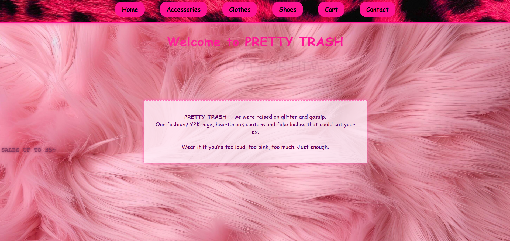
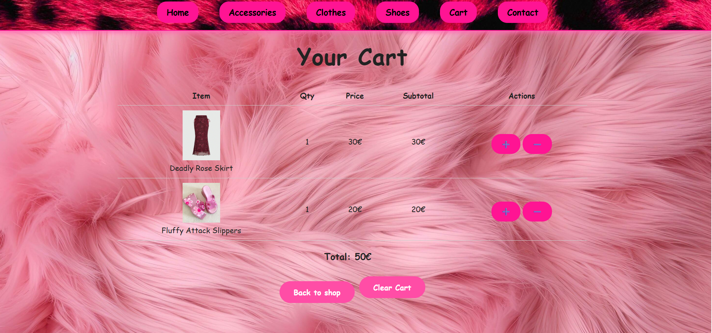

# PrettyTrash

PrettyTrash is a production-ready web application template for a stylish e-commerce shop. Build on Flask.
Because shopping sucks. This makes it suck with ✨ style ✨ and solid engineering.


## 📸 Interface Preview

Here is a look inside the application architecture and UI:

1. **Product Catalog Grid**
   Users can browse items dynamically sorted into distinct categories.
   

2. **Synchronized Cart Terminal**
   Live updates of items, quantities, and the final total sum calculated strictly on the backend.
   

## 🛠️ Tech Stack

* **Backend:** Python (Flask Framework)
* **Frontend:** HTML ,CSS,JAVA SCRIPT

## ⚙️ Quick Start (Local Setup)

Follow these steps to run the application on your local machine:

1. Clone the repository:
```bash
   git clone [https://github.com/Daryamdev/pretty_trash.git](https://github.com/Daryamdev/pretty_trash.git)
   cd pretty_trash
```

2. Setup and Run Backend
```bash
#Open a terminal in the root folder and run:

#Create new enviroment:
#Activate the enviroment:
on Windows
venv\Scripts\activate

#on Linux/Mac
source venv/bin/activate 

#Install Dependencies

pip install -r requirements.txt
```
3. Lounch the server:
```bash
python shop.py

#Access the application:
(http://127.0.0.1:5000)
```
